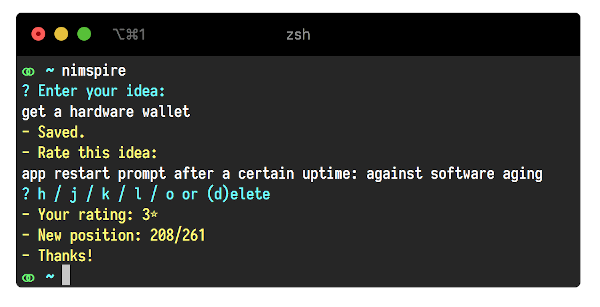

# Nimspire

Save and rate your ideas with this ultra-lightweight idea incubator CLI app.

I have a lot of ideas, but sometimes it's hard to judge its "goodness" immediately.
Nimspire lets you enter a new idea and then shows you a previous idea which you can rate from 1 to 5 stars.

### How it works

- If you rate it 1 star, it will reinsert it at the end of your idea list.
- If you rate it 5 stars, it puts it in the middle.
- The `d` key deletes the idea.
- When reviewing, it always shows the first idea of your collection (top of the list).
- When adding a new idea, it puts it at the end of the list, so it's properly incubated.

Extra feature: you can specify a backup directory (e.g. google drive folder, keybase, etc.), so you can use it on multiple devices. 

You can add the `nimspire review` command to the end of your `.zshrc` or `.bashrc`, so your idea ratings remain up-to-date.

### Requirements

- [Nim compiler](https://nim-lang.org/install.html)
- On MacOS you can simply run `brew install nim`

### Build

`nim c -d:release nimspire.nim`

### Usage

- Add a new idea a rate one: `nimpsire`
- Only review: `nimspire review`
- Only add: `nimspire add`

I recommend adding the nimspire dir to your `PATH`, so you can simply enter the command "nimspire".

You can find your ideas at `~/.nimspire/nimspire.db.txt`

Every line contains one idea. You can delete / reorder them manually too.

You can set up a backup folder in your `~/.nimspire/nimspire.ini`,
so you can sync your notes on multiple devices.

### Credits

Mice Pápai, 2017

> Contributions are welcome
